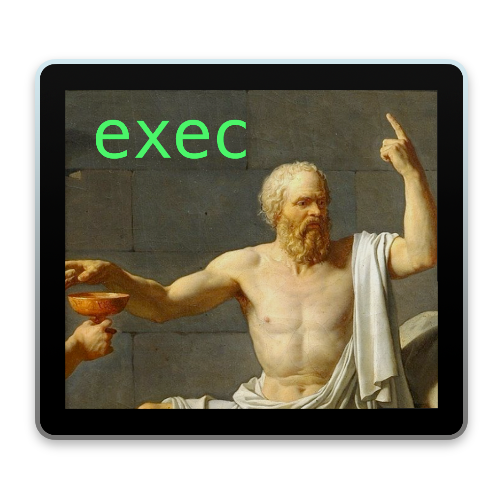

 </img>
<h1> socrates </h1>
Under construction!

## Socials:

 

## Download:

  

## Developers:

 

 

 

 

## Features:
Under construction!

## Setup:
Under construction!

## Usage:
Under construction!

## License:
This project is licensed under the `GNU Lesser General Public License v2.1` license.

License information can be found in `docs/LICENSE.md`.
